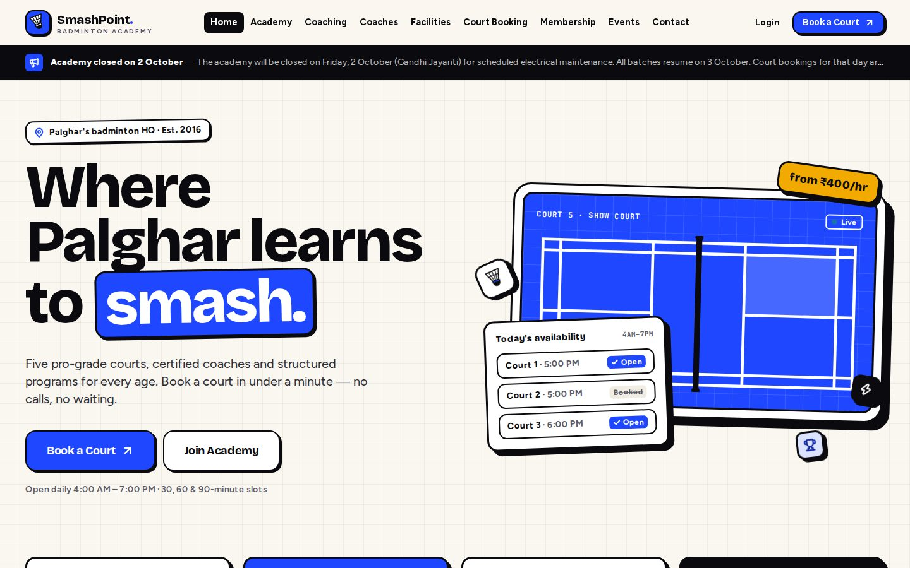
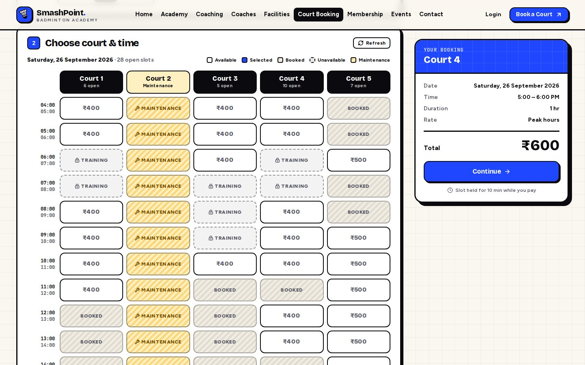
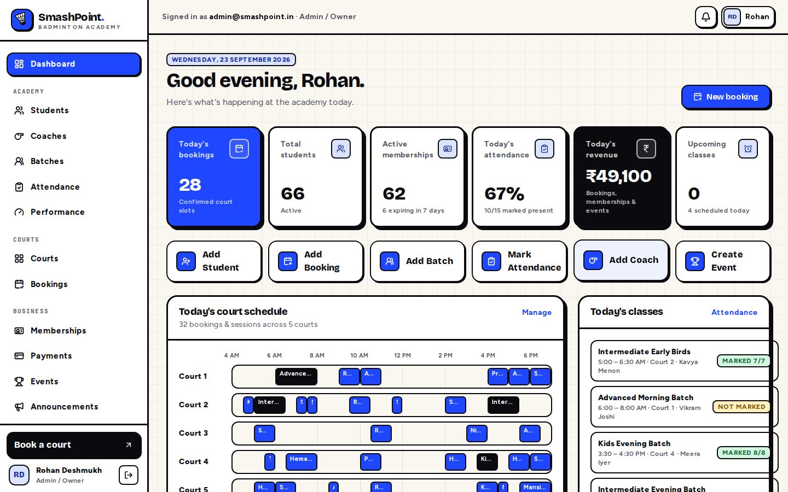
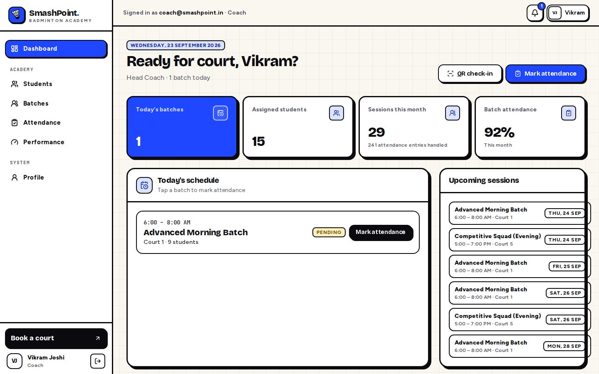
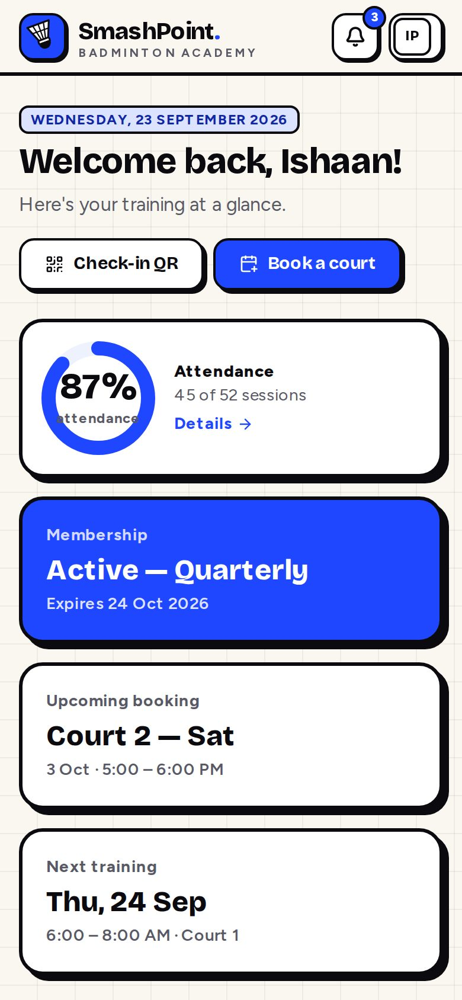
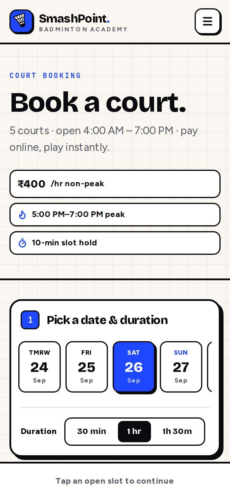

# SmashPoint Badminton Academy

A production-ready badminton academy platform: a public marketing website, a court-booking system with payments, and a role-based management app for students, coaches, batches, attendance, memberships, events and reports.

Built with **Next.js 16 (App Router) · TypeScript · Tailwind CSS v4 · PostgreSQL · Drizzle ORM**. The design system is a playful neo-brutalist SaaS look: grid paper, heavy type, thick outlines, hard shadows and one electric-blue accent.

| Public site | Court booking | Admin dashboard |
| --- | --- | --- |
|  |  |  |

| Coach dashboard | Student (mobile) | Booking (mobile) |
| --- | --- | --- |
|  |  |  |

---

## Quick start

Requirements: Node.js ≥ 20.9 and PostgreSQL 14+ (16 recommended).

```bash
# 1. Database (or point DATABASE_URL at any Postgres, e.g. Neon/Supabase)
docker compose up -d

# 2. App
npm install
cp .env.example .env            # then set AUTH_SECRET (openssl rand -base64 48)
npm run db:migrate              # creates tables, indexes and the booking EXCLUDE constraint
npm run db:seed                 # realistic demo academy (idempotent — wipes & reseeds)
npm run dev                     # http://localhost:3000
```

### Demo accounts

All passwords: `SmashPoint@123`. In development the login page has one-click buttons for each account.

| Role | Email | What to try |
| --- | --- | --- |
| Admin / Owner | `admin@smashpoint.in` | Everything: courts & pricing, reports, settings, staff |
| Manager | `manager@smashpoint.in` | Students, bookings, memberships, payments, events, reports |
| Coach | `coach@smashpoint.in` | Today's batches, attendance marking, QR check-in, skill assessments |
| Reception | `reception@smashpoint.in` | Walk-in bookings, students, payments, QR check-in |
| Student | `student@smashpoint.in` | Dashboard (87% attendance, active membership), bookings, QR code |
| Parent | `parent@smashpoint.in` | Two children — switch between them on every student page |

Payments run through a built-in **sandbox gateway** by default: checkout opens a hosted test page where you can pay or simulate a failure.

### Scripts

| Command | Purpose |
| --- | --- |
| `npm run dev` / `build` / `start` | Next.js dev server / production build / production server |
| `npm run typecheck` | Regenerates route types and runs `tsc` |
| `npm test` | Unit tests (booking engine, pricing, RBAC, CSV/XLSX export) |
| `npm run db:generate` | Generate a migration after editing `src/server/db/schema.ts` |
| `npm run db:migrate` · `db:seed` · `db:reset` | Apply migrations · load demo data · drop everything and rebuild |

---

## What's included

**Public website**: Home (hero, stats, academy, programs, facilities, why us, coaches, booking CTA, membership plans, events, testimonials, FAQ, contact CTA), Academy/About, Coaching programs, Coaches, Facilities, Court Booking, Membership, Events (+ detail and registration), Contact (map, form, WhatsApp, socials). Every page has unique metadata, Open Graph tags, a sitemap, robots.txt and JSON-LD where relevant.

**Court booking**: one screen with date strip → duration (30/60/90) → availability grid (courts × times on desktop, court tabs and thumb-sized tiles on mobile) → details → payment → receipt. The states are Available, Selected, Booked, Unavailable (training/blocked/past) and Maintenance, and peak slots are flagged. Slots are held for 10 minutes during checkout. Coupons and member discounts are applied server-side. The receipt shows the Booking ID, amount, payment status, lifecycle timeline, an add-to-calendar (.ics) file, a printable receipt and self-service cancellation with refund.

**Role-based app** (`/dashboard`):

| Area | Highlights |
| --- | --- |
| Student / parent | Welcome, upcoming training & bookings, attendance %, membership status & expiry, payments, notifications, skill snapshot, personal check-in QR, online membership purchase/renewal, child switcher for parents |
| Coach | Today's schedule, one-tap attendance sheets (Present / Absent / Late / Leave + class notes), QR scanner, assigned students, monthly 8-skill assessments with progress charts |
| Admin / manager / reception | KPI tiles, per-court timeline for today, today's classes, revenue & attendance charts, quick actions, expiring memberships, website enquiries |
| Students | Search, filters (status, level, batch, coach, membership), sorting, pagination, full profiles with parent/emergency info, photo upload, batches, printable ID card with QR |
| Courts | Add/rename courts, non-peak & peak rates, maintenance mode, operating hours, durations, configurable peak windows, blocked slots and date-range maintenance |
| Bookings | Search & filter by date/court/status/source, walk-in bookings with cash/UPI/card, reschedule, cancel & refund, payment history, lifecycle audit |
| Batches · Coaches · Memberships · Payments · Events · Announcements | Full CRUD with capacity checks, court-clash detection, renewals that never lose days, refunds, registrations, audience-targeted announcements |
| Reports | Revenue (daily/weekly/monthly/yearly), bookings (peak hours, most-used court, cancellation rate), students, coaches, all exportable to **CSV or Excel** |
| Settings | Staff accounts, coupons, notification channels, attendance rules, integration status, audit log |

---

## Architecture

```
src/
  app/
    (site)/            public website (header/footer layout)
    (auth)/            login & registration
    dashboard/         role-based app (one sidebar, permission-filtered)
    api/               availability, bookings, payments (+ webhooks), attendance scan, exports, cron, media
    checkout/mock/     sandbox payment gateway page
  components/
    ui/                design system: button, card, form, modal, dropdown, tabs, table, toast, calendar, charts…
    booking/ marketing/ site/ app/ attendance/ forms/ payments/ …
  content/site.ts      all marketing copy (name, contact, stats, testimonials, FAQ…) in one file
  lib/                 pure, isomorphic logic: booking engine, time/format helpers, RBAC, validation
  server/
    db/                Drizzle schema + client
    auth/              scrypt passwords, signed session tokens, DB-backed sessions, guards
    services/          bookings, cancellation, attendance, jobs, coupons…
    payments/          provider interface, sandbox & Razorpay adapters, capture/refund service
    notifications/     in-app notifications + email/SMS/WhatsApp adapters with delivery log
    actions/           server actions (every one validates input and checks permissions)
    queries/           read models for pages
drizzle/               SQL migrations (incl. the custom EXCLUDE constraint)
scripts/               migrate, seed, reset
```

### Double booking is impossible

1. **UI**: the grid only offers free slots and refreshes every 45 s. If a selected slot is taken, the selection is dropped with a toast.
2. **Service**: `createBooking` runs in a transaction that locks the court row (`SELECT … FOR UPDATE`), releases expired holds, and re-checks bookings, maintenance/blocked windows and training batches.
3. **Database**: a PostgreSQL `EXCLUDE USING gist (court_id WITH =, date WITH =, int4range(start_minute, end_minute) WITH &&)` constraint over active bookings. Even a raw SQL insert can't create an overlap.

Tested with 8 concurrent requests for one slot: exactly one succeeds and the rest get a clean `409`.

### Booking & payment lifecycle

`Pending → Payment Initiated → Paid → Confirmed`, plus `Cancelled → Refunded` and `Expired` for abandoned holds. Every transition is written to `booking_events` and shown on the receipt. A payment that arrives after its hold expired reactivates the booking only if the slot is still free; if not, it's refunded automatically.

### Payment gateway abstraction

The app only talks to `PaymentProvider` (`src/server/payments/types.ts`): `createOrder`, `verifyPayment`, `parseWebhook`, `refund`. Checkout returns a provider-agnostic instruction (`redirect` or SDK payload), and capture always verifies a signature server-side and is idempotent.

- `mock`: sandbox gateway (default). Uses the same HMAC verification path as a real provider.
- `razorpay`: Orders API + Checkout.js + webhook signature verification. Set `PAYMENT_PROVIDER=razorpay` and the `RAZORPAY_*` variables, and point the Razorpay webhook to `/api/payments/webhook/razorpay`.
- **Adding Cashfree / PhonePe / Stripe**: implement the interface in `src/server/payments/providers/<name>.ts` and register it in `src/server/payments/index.ts`. No booking code changes.

### Roles & permissions

Permissions live in `src/lib/rbac.ts` and are checked in three places: the proxy (fast, token-only redirect for `/dashboard`), every page guard, and every server action or API route (authoritative, DB-backed session). Coaches are additionally scoped to their own batches and students.

| Permission area | Admin | Manager | Coach | Reception | Student |
| --- | :-: | :-: | :-: | :-: | :-: |
| Courts, pricing, settings, staff | ✅ | view | — | view | — |
| Bookings | ✅ | ✅ | — | ✅ | own |
| Students | ✅ | ✅ | assigned (view) | ✅ | own/children |
| Batches | ✅ | ✅ | assigned | view | own |
| Attendance | ✅ | ✅ | mark (own batches) | QR scan | own |
| Memberships | ✅ | ✅ | — | view | own |
| Payments / refunds | ✅ | ✅ | — | record | own |
| Events, announcements, reports | ✅ | ✅ | — | — | — |

### Notifications

`notify()` stores an in-app notification and fans out to email, SMS and WhatsApp according to academy settings and each user's preferences. Every attempt is recorded in `notification_deliveries`. Email via Resend works when `RESEND_API_KEY` is set. SMS and WhatsApp adapters are stubs in `src/server/notifications/channels.ts`: plug in MSG91, Twilio, Gupshup or the Meta Cloud API. Unconfigured channels are logged as `SKIPPED`.

**Scheduled jobs** (`GET /api/cron/reminders` with `Authorization: Bearer $CRON_SECRET`, hourly; `vercel.json` includes the Vercel Cron entry) handle:
- booking reminders
- membership-expiry reminders (skipped if already renewed)
- next-day class reminders
- releasing expired holds
- expiring memberships
- cancelling abandoned checkouts

### Attendance & QR check-in

Each student has a random, rotatable QR token (shown in their dashboard and on a printable ID card). The scanner page uses the browser `BarcodeDetector` with a `jsQR` fallback, and also accepts USB scanners or typed input. A scan verifies the student, their enrolment, and that the batch runs today. It marks Present, or Late after a configurable grace period. A unique `(session, student)` index means a student can never be marked twice.

### Data model

Core tables: `users`, `sessions`, `students`, `parents`, `coaches`, `courts`, `court_blocks`, `bookings`, `booking_events`, `payments`, `membership_plans`, `memberships`, `programs`, `batches`, `batch_students`, `attendance_sessions`, `attendance_records`, `performance_records`, `events`, `event_registrations`, `tournament_matches`, `announcements`, `notifications`, `notification_deliveries`, `coupons`, `settings`, `enquiries`, `media`, `audit_logs`.

How these map to the requested entities:
- **Court slots** are computed from operating hours and duration rather than stored. Maintenance and blocked overrides live in `court_blocks`.
- **Attendance / AttendanceRecords** are `attendance_sessions` (one sheet per batch per day, with class notes) and `attendance_records`.
- **Tournament brackets**: `tournament_matches` already exists (rounds, players, winner, score, court), so brackets and results can be added without a migration.

Conventions: money is stored as integers in **paise**; academy-local dates are `date`s and times of day are minutes from midnight (operating hours never cross midnight), which keeps availability maths and the overlap constraint timezone-proof.

### Security

- Passwords hashed with scrypt, compared in constant time.
- Sessions are signed tokens backed by a `sessions` table, so they can be revoked (password change signs out other devices).
- Cookies are `httpOnly`, `sameSite=lax`, and `secure` in production.
- Login, registration, booking and contact form submissions are rate-limited.
- Every input is validated with Zod on the server.
- Server actions get Next.js origin checks, and cookie-authenticated JSON APIs require a same-origin request.
- Guest booking receipts need an HMAC-signed link, so booking codes can't be enumerated.
- Uploads are checked by size and magic bytes and served with `nosniff` and a locked-down CSP.
- CSV exports neutralise spreadsheet formulas.
- Security headers are set and `x-powered-by` is disabled.
- Sensitive admin actions are written to `audit_logs`.

### Caching & performance

- Public pages read through `unstable_cache` with tags, and admin changes invalidate those tags immediately.
- Static pages (Facilities, robots, OG image) are prerendered.
- Dashboards are server components with parallel queries and indexed filters.
- Pagination is done in SQL.
- Charts are dependency-free SVG.
- Fonts are self-hosted via `next/font`.
- Date and money formatting is deterministic, so there are no hydration mismatches.

---

## Customising

- **Academy content** (name, address, phone, stats, story, testimonials, FAQ, facilities): `src/content/site.ts`.
- **Courts, prices, peak windows, hours, durations, maintenance**: Dashboard → Courts. No code changes.
- **Programs, coaches, plans, events, announcements, coupons**: managed in the dashboard. Starting data is in `scripts/seed.ts`.
- **Photos**: upload coach and student photos from their profile pages. Until then, a styled placeholder with initials is shown.
- **Design tokens** (colours, shadows, radii, fonts): the `@theme` block in `src/app/globals.css`.

## Deploying

Works on Vercel, Render, Railway, Fly or any Node host with PostgreSQL.

1. Provision Postgres (Neon, Supabase, RDS…) and set `DATABASE_URL`.
2. Set `AUTH_SECRET`, `NEXT_PUBLIC_SITE_URL`, `CRON_SECRET` and the payment/notification variables from `.env.example`.
3. Run `npm run db:migrate` against the production database. Only run `db:seed` for a demo.
4. Build: `npm run build`. The build doesn't need database access.
5. Schedule `GET /api/cron/reminders` hourly. `vercel.json` already does this on Vercel.

The in-memory rate limiter is per instance. For multi-instance deployments, swap `rateLimit` in `src/server/security.ts` for Redis or Upstash. Uploaded images are stored in Postgres for simplicity, and `src/server/media.ts` is the single place to switch to S3 or R2.
